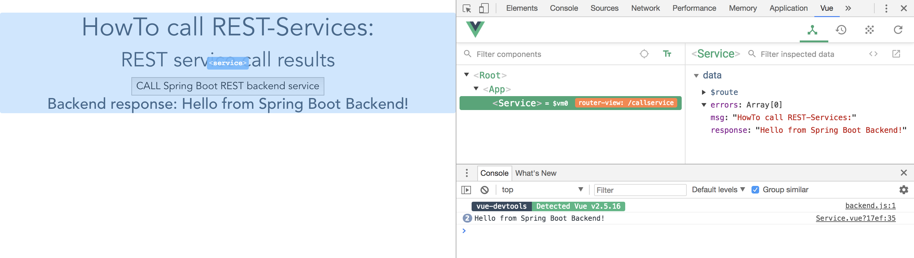
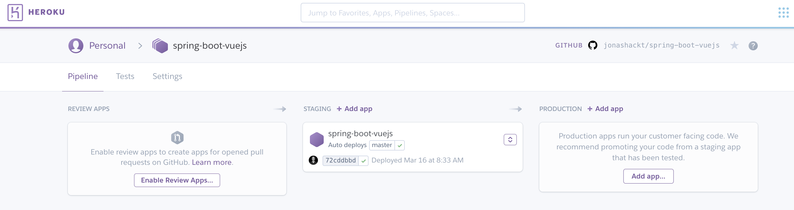
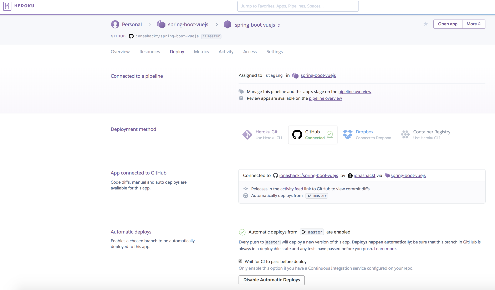

# Trabalho de PDS


## Setup Vue.js & Spring Boot

### Prerequisites

#### MacOSX

```
brew install node
npm install --global vue-cli
```

#### Linux

```
sudo apt update
sudo apt install node
npm install --global vue-cli
```

#### Windows

```
choco install npm
npm install --global vue-cli
```

(Oder per Installer von der Website: https://nodejs.org/en/download/)

## Project setup

```
git clone https://github.com/CristianZatt/trabalhoPDS

npm install //instala as dependencias
```

## Estrutura
```
spring-boot-vuejs
├─┬ backend     → backend module with Spring Boot code
│ ├── src
│ └── pom.xml
├─┬ frontend    → frontend module with Vue.js code
│ ├── src
│ └── pom.xml
└── pom.xml     → Maven parent pom managing both modules
```

## First App run

```
mvn clean install
```

Run our complete Spring Boot App:

```
mvn --projects backend spring-boot:run
```

Now go to http://localhost:8088/ and have a look at your first Vue.js Spring Boot App.


## fast feedback with webpack-dev-server

The webpack-dev-server, which will update and build every change through all the parts of the JavaScript build-chain, is pre-configured in Vue.js out-of-the-box! So the only thing needed to get fast feedback development-cycle is to cd into `frontend` and run:

```
npm run dev
```

That’s it! 


## Browser developer tools extension

Install vue-devtools Browser extension https://github.com/vuejs/vue-devtools and get better feedback, e.g. in Chrome:



## IntelliJ integration

There's a blog post: https://blog.jetbrains.com/webstorm/2018/01/working-with-vue-js-in-webstorm/

Especially the `New... Vue Component` looks quite cool :)


## HTTP calls from Vue.js to (Spring Boot) REST backend

Prior to Vue 2.0, there was a build in solution (vue-resource). But from 2.0 on, 3rd party libraries are necessary. One of them is [Axios](https://github.com/mzabriskie/axios) - also see blog post https://alligator.io/vuejs/rest-api-axios/

```
npm install axios --save
```

Calling a REST service with Axios is simple. Go into the script area of your component, e.g. Hello.vue and add:

```js
import axios from 'axios'

data (){
  return {
    response: [],
    errors: []
  }
},

callRestService (){
  axios.get(`api/hello`)
    .then(response => {
      // JSON responses are automatically parsed.
      this.response = response.data
    })
    .catch(e => {
      this.errors.push(e)
    })
}
}
```

In your template area you can now request a service call via calling `callRestService()` method and access `response` data:

```html
<button class=”Search__button” @click="callRestService()">CALL Spring Boot REST backend service</button>

<h3>{{ response }}</h3>
```

## Heroku Deployment

As you may already read, the app is automatically deployed to Heroku on https://spring-boot-vuejs.herokuapp.com/.

The project makes use of the nice Heroku Pipelines feature, where we do get a full Continuous Delivery pipeline with nearly no effort:



And with the help of super cool `Automatic deploys`, we have our TravisCI build our app after every push to master - and with the checkbox set to `Wait for CI to pass before deploy` - the app gets also automatically deployed to Heroku - but only, if the TravisCI (and Coveralls...) build succeeded:



You only have to connect your Heroku app to GitHub, activate Automatic deploys and set the named checkbox. That's everything!


#### Accessing Spring Boot REST backend on Heroku from Vue.js frontend

Frontend needs to know the Port of our Spring Boot backend API, which is [automatically set by Heroku every time, we (re-)start our App](https://stackoverflow.com/a/12023039/4964553).

> You can [try out your Heroku app locally](https://devcenter.heroku.com/articles/heroku-local)! Just create a .env-File with all your Environment variables and run `heroku local`! 

To access the Heroku set port, we need to use relative paths inside our Vue.js application instead of hard-coded hosts and ports! 

All we need to do is to configure Axios in such a way inside our [frontend/src/components/http-common.js](https://github.com/jonashackt/spring-boot-vuejs/blob/master/frontend/src/components/http-common.js):

```
export const AXIOS = axios.create({
  baseURL: `/api`
})
```

#### Using Heroku's Postgres as Database for Spring Boot backend and Vue.js frontend

First, add [Heroku Postgres database](https://elements.heroku.com/addons/heroku-postgresql) for your Heroku app. 

Then follow these instructions on Stackoverflow to configure all needed Environment variables in Heroku: https://stackoverflow.com/a/49978310/4964553

Mind the addition to the backend's [pom.xml](backend/pom.xml) described here: https://stackoverflow.com/a/49970142/4964553

Now you're able to use Spring Data's magic - all you need is an Interface like [UserRepository.java](backend/src/main/java/de/jonashackt/springbootvuejs/repository/UserRepository.java):

```java
package de.jonashackt.springbootvuejs.repository;

import de.jonashackt.springbootvuejs.domain.User;
import org.springframework.data.repository.CrudRepository;
import org.springframework.data.repository.query.Param;

import java.util.List;

public interface UserRepository extends CrudRepository<User, Long> {

    List<User> findByLastName(@Param("lastname") String lastname);

    List<User> findByFirstName(@Param("firstname") String firstname);

}

```


## NPM Security

npm Security - npm@6

https://medium.com/npm-inc/announcing-npm-6-5d0b1799a905

`npm audit`

https://blog.npmjs.org/post/173719309445/npm-audit-identify-and-fix-insecure

Run `npm audit fix` to update the vulnerable packages. Only in situations, where nothing else helps, try `npm audit fix --force` (this will also install braking changes)

https://nodejs.org/en/blog/vulnerability/june-2018-security-releases/

---> __Update NPM regularly__

https://docs.npmjs.com/troubleshooting/try-the-latest-stable-version-of-npm

`npm install -g npm@latest`

---> __Update Packages regularly__

https://docs.npmjs.com/getting-started/updating-local-packages

`npm outdated`

`npm update`


# Links

Nice introductory video: https://www.youtube.com/watch?v=z6hQqgvGI4Y

Examples: https://vuejs.org/v2/examples/

Easy to use web-based Editor: https://vuejs.org/v2/examples/

http://vuetips.com/
